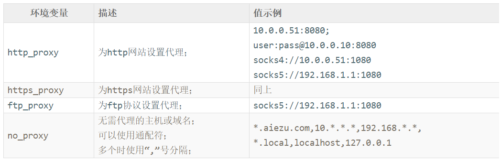

# Linux bash终端设置代理(proxy)访问


Linux是开源操作系统，有很多软件包需要从国外网站上下载，而其中大部分国外网站是被墙的，这时我们需要通过代理来访问这些网站。下面我们介绍Linux bash shell终端代理设置方法，包括socks代理，http代理。


## linux shell终端代理设置方法


linux要在shell终端为http、https、ftp协议设置代理，值需要设置对应的环境变量即可。下面是**一些关于代理的环境变量**：

　　
可以将上面4个环境变量设置项放于**~/.bashrc**文件尾部，这样用户打开bash shell终端时会自动调用此脚本，读入它们。


## linux bash为http站点设置代理


根据代理类型，将下面对应的设置项添加到~/.bashrc文件末尾，然后运行". ~/.bashrc"（前面是一个“.”号）命令使用之在当前环境生效。
1) 为http站点设置http代理（默认）
```bash
export http_proxy=10.0.0.52:8080
```

2) 为http站点设置sock4、sock5代理：
```bash
# 设置 socks 代理，自动识别socks版本
export http_proxy=socks://10.0.0.52:1080

# 设置 socks4 代理
export http_proxy=socks4://10.0.0.52:1080

# 设置 socks5 代理
export http_proxy=socks5://10.0.0.52:1080
```

3) 代理使用用户名密码认证
```bash
export http_proxy=user:pass@192.158.8.8:8080
```


## linux bash为https站点设置代理


如果需要为https网站设置代理，设置https_proxy环境变量即可；设置方法完全与http_proxy环境变量相同：
```bash
# 任意使用一项
export https_proxy=10.0.0.52:8080
export https_proxy=user:pass@192.158.8.8:8080
export https_proxy=socks://10.0.0.52:1080
export https_proxy=socks4://10.0.0.52:1080
export https_proxy=socks5://10.0.0.52:1080
```


##举例


现在我们要设置http、https网站都使用socks5代理10.0.0.52:1080，下面为完整设置方法：
1) vim ~/.bashrc，在文件尾部添加下面内容
```bash
export http_proxy=socks5://10.0.0.52:1080
export https_proxy=socks5://10.0.0.52:1080
export no_proxy="*.aiezu.com,10.*.*.*,192.168.*.*,*.local,localhost,127.0.0.1"
```


2) 加载设置
```bash
[root@aiezu.com ~]# . ~/.bashrc
[root@aiezu.com ~]# echo $http_proxy
socks5://10.0.0.52:1080
[root@aiezu.com ~]# echo $https_proxy
socks5://10.0.0.52:1080
```

3) 测试代理
```bash
[root@aiezu.com ~]# curl -I http://www.fackbook.com
HTTP/1.1 200 OK
Content-Length: 2423
Content-Type: text/html
Last-Modified: Mon, 14 Nov 2016 22:03:32 GMT
Accept-Ranges: bytes
ETag: "0521af0c23ed21:0"
Server: Microsoft-IIS/7.5
X-Powered-By: ASP.NET
Date: Sun, 11 Dec 2016 13:21:33 GMT
```
