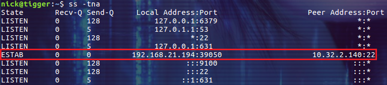

# Linux ss命令


ss是Socket Statistics的缩写。ss命令可以用来获取socket统计信息，它显示的内容和netstat类似。但ss的优势在于它能够显示更多更详细的有关 TCP 和连接状态的信息，而且比 netstat 更快。当服务器的 socket 连接数量变得非常大时，无论是使用netstat命令还是直接 cat /proc/net/tcp，执行速度都会很慢。ss 命令利用到了TCP协议栈中tcp_diag。tcp_diag是一个用于分析统计的模块，可以获得Linux 内核中第一手的信息，因此 ss 命令的性能会好很多。


## 常用选项


-h, --help 			帮助
-V, --version		显示版本号
-t, --tcp			显示 TCP 协议的 sockets
-u, --udp 			显示 UDP 协议的 sockets
-x, --unix			显示 unix domain sockets，与 -f 选项相同
-n, --numeric		不解析服务的名称，如 "22" 端口不会显示成 "ssh"
-l, --listening		只显示处于监听状态的端口
-p, --processes		显示监听端口的进程(Ubuntu 上需要 sudo)
-a, --all 			对TCP协议来说，既包含监听的端口，也包含建立的连接
-r, --resolve 		把IP解释为域名，把端口号解释为协议名称


## 常见用例


如果不添加选项，ss命令默认输出所有建立的连接(**不包含监听的端口**)，包括 tcp, udp, and unix socket 三种类型的连接：


### 查看主机监听的端口

```bash
$ ss -tnl
```


### 通过-r选项解析IP和端口号

```bash
$ ss -tlr
```


### 使用-p选项查看监听端口的程序名称


```bash
$ sudo ss -tlp
```


最后一列就是运行的程序名称。还可以通过grep继续过滤：
```bash
$ sudo ss -tlp | grep ssh
```


### 查看建立的TCP连接


-a --all 对 TCP 协议来说，既包含监听的端口，也包含建立的连接
```bash
$ ss -tna
```




### 显示更多的信息


-o, --options 显示时间信息
-m, --memory 显示 socket 使用的内存
-i, --info 显示更多 TCP 内部的信息


### 显示摘要信息


```bash
$ ss -s
```


## dst/src dport/sport 语法


**可以通过dst/src/dport/sprot 语法来过滤连接的来源和目标，来源端口和目标端口**。


### 匹配远程地址和端口号

```bash
$ ss dst 192.168.1.5
$ ss dst 192.168.119.113:http
$ ss dst 192.168.119.113:443
```


### 匹配本地地址和端口号

```bash
$ ss src 192.168.119.103
$ ss src 192.168.119.103:http
$ ss src 192.168.119.103:80
```


### 将本地或者远程端口和一个数比较

可以使用下面的语法做端口号的过滤：
```bash
$ ss dport OP PORT
$ ss sport OP PORT
```

OP 可以代表以下任意一个：

| <= | le |	小于或等于某个端口号 |
|----|----|----------------------|
| >= | ge |	大于或等于某个端口号 |
| == | eq |	等于某个端口号		 |
| != | ne |	不等于某个端口号	 |
| >	 | gt |	大于某个端口号		 |
| <	 | lt |	小于某个端口号		 |

下面是一个简单的 demo(注意，需要对尖括号使用转义符)：
```bash
$ ss -tunl sport lt 50
$ ss -tunl sport \< 50
```


## 通过TCP的状态进行过滤

ss命令还可以通过TCP连接的状态进程过滤，支持的TCP协议中的状态有：
+ established
+ syn-sent
+ syn-recv
+ fin-wait-1
+ fin-wait-2
+ time-wait
+ closed
+ close-wait
+ last-ack
+ listening
+ closing


除了上面的 TCP 状态，还可以使用下面这些状态：


| all 			|	列出所有的 TCP 状态。							|
|---------------|---------------------------------------------------|
| connected		| 列出除了 listening 和 closing 之外的所有 TCP 状态 |
| synchronized	| 列出除了 syn-sent 之外的所有 TCP 状态。			|
| bucket	    | 列出 maintained 的状态，如：time-wait 和 syn-recv |
| big			| 列出和 bucket 相反的状态。						|


使用 ipv4 时的过滤语法如下:
```bash
$ ss -4 state filter
```


使用 ipv6 时的过滤语法如下：
```bash
$ ss -6 state filter
```


下面是一个简单的例子：
```bash
$ ss -4 state listening
```


## 同时过滤 TCP 的状态和端口号

(注意下面命令中的转义符和空格，都是必须的。如果不用转义符，可以使用单引号)
下面的命令显示所有状态为 established 的 ssh 连接：
```bash
$ ss -4n  state listening
```

下面的两种写法是等价的，要有使用 \ 转义小括号，要么使用单引号括起来：
```bash
$ ss -4n  state listening \( dport = :ssh  \)
$ ss -4n  state listening '( dport = :ssh  )' 
```


只是最后的结果稍微让人有些意外，不仅显示了监听的端口，也显示了通过 22 端口建立的连接。

下面我们显示所有状态为 Established 的 HTTP 连接：
```bash
$ ss state established '( sport = :http or dport = :http )'
```


下面的命令列出所有连接到 22 端口的连接和对 22 端口的监听：
```bash
$ ss state all dport = :22
```


下面是一个来自 ss man page 的例子，它列举出处于 FIN-WAIT-1状态的源端口为 80 或者 443，目标网络为 193.233.7/24 所有 TCP 套接字：
```bash
$ ss state fin-wait-1 '( sport = :http or sport = :https )' dst 193.233.7/24 
```


## 总结


由于性能出色且功能丰富，ss 命令可以用来替代 netsate 命令成为我们日常查看 socket 相关信息的利器。其实抛弃 netstate 命令已经是大势所趋，有的 Linux 版本默认已经不再内置 netstate 而是内置了 ss 命令。


出处：[sparkdev](http://www.cnblogs.com/sparkdev/)

